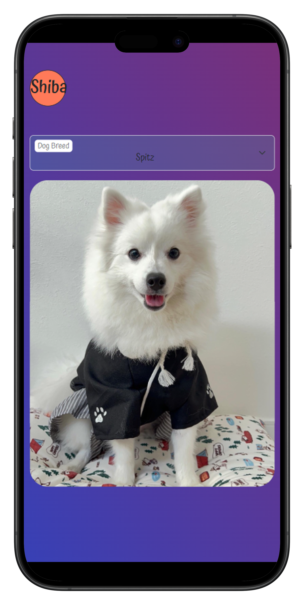

# Shiba

## What is in the project?

`Fragment` a handy feature to use when working with multiple node insertions at a time in the DOM
`Asynchronous` -refers to processes that occur independently and do not require simultaneous execution or immediate response.

`Synchronous` -refers to processes that occur in a coordinated manner, requiring tasks to be executed one after the other in a sequential order.

`Await` - to wait

`fetch` - to get something network request - to get some data using the internet

`API` - using an external service (dogsapi)

`errors` - when things go wrong

`status code` (100-500)

`error handeling`, `failing gracefully `

`.then, .catch` - .then when we get the data otherwise catch in case of error

`promises` - future value

`promise.then().catch()`

# API

- get dogs
- get dogs by breed
- get dogs by age
- get dogs by breed and age
- get dogs by breed and age and color

# Error handling

- catching errors
- handling errors
